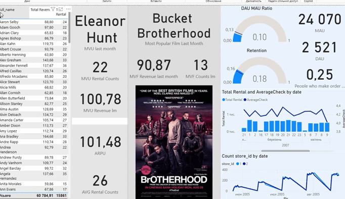
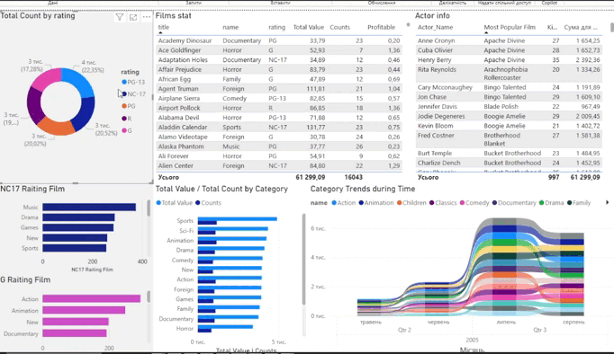
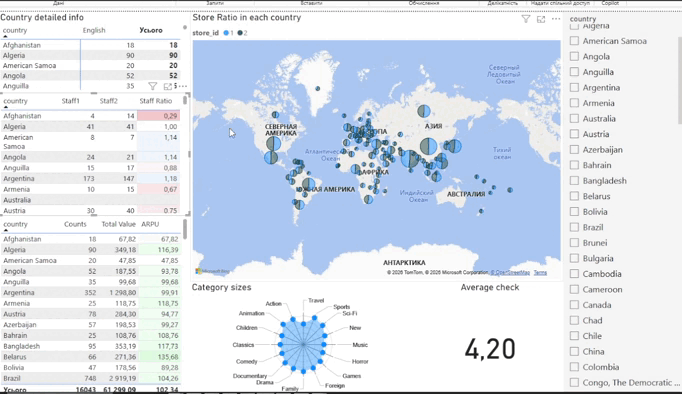

# 🎬 Movie Rental Business Intelligence Dashboard

## 📌Overview
This project is a comprehensive BI solution for a movie rental business (based on the Sakila database). It transforms raw transactional data into strategic insights regarding customer behavior, content popularity, and financial performance.

The dashboard is designed with a focus on **Actionable Analytics**, allowing stakeholders to track not just "what happened," but "who is returning" and "what content drives revenue."

---

## 📊 Key Analytics Modules

### 1. Customer Retention & Engagement
* **MAU (Monthly Active Users):** Tracks total revenue from active customers in the current period.
* **New Customer Retention:** A cohort-based analysis that monitors how many first-time renters from the previous month returned in the current month.
* **Stickiness Metrics:** DAU/MAU ratios to analyze audience engagement frequency.


### 2. Content & Actor Intelligence
* **Top Content Tracking:** Automated identification of the "Monthly Hit" based on rental volume.
* **Actor Performance:** A dynamic calculation that identifies the most popular film for every actor in the database.
* **MVF (Most Valuable Film) Counts:** Real-time tracking of rental volumes for top-performing titles.


### 3. Financial Performance
* **MVU (Most Valuable User) Revenue:** Calculates the exact revenue contribution from the top customer of the previous month.
* **Global Sales Geography:** Interactive map visualizing revenue distribution and store performance across different regions.


---

## 🛠 Technical Implementation (DAX Excellence)

The project utilizes advanced DAX patterns, including time intelligence, nested filtering, and virtual table manipulations.

### Example: Tracking Top Customer Revenue (MVU)
This measure dynamically identifies the top customer by name and calculates their specific revenue contribution for the previous month.
```dax
MVU Revenue lm = 
VAR LatestDate = MAX('public payment'[payment_date_only])
VAR StartDate = EOMONTH(LatestDate, -1) + 1
VAR EndDate = LatestDate
VAR MostActiveCustomerName = [MVU last month]  

RETURN 
    CALCULATE(
        SUM('public payment'[amount]),
        FILTER(
            DISTINCT('public customer'),
            'public customer'[full_name] = MostActiveCustomerName
        ),
        'public payment'[payment_date_only] >= StartDate,
        'public payment'[payment_date_only] <= EndDate
    )
```

### Example: Monthly Hit Discovery
Automated logic to extract the title of the most rented movie within the last month context.

```dax
Most Popular Film Last Month = 
VAR LatestDate = MAX('public rental'[Only Date])
VAR StartDate = EOMONTH(LatestDate, -1) + 1
RETURN
    CALCULATE(
        MAX('public film'[title]),
        TOPN(1, VALUES('public film'[title]), [Total Rental], DESC),
        'Date Table'[Date] >= StartDate,
        'Date Table'[Date] <= LatestDate
    )
```


